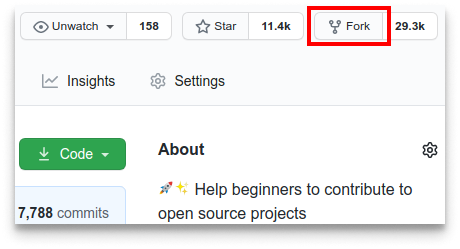
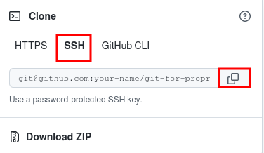
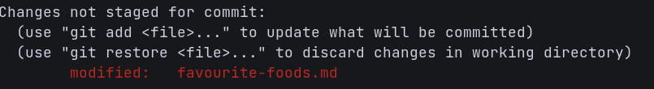
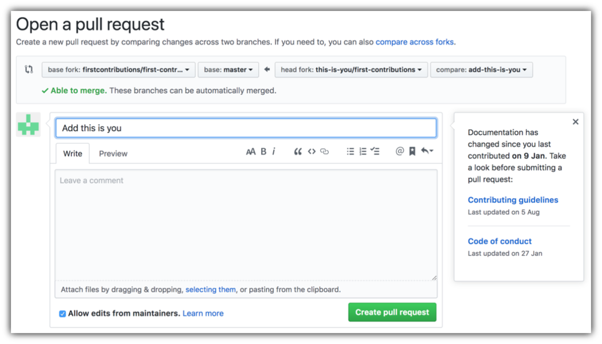
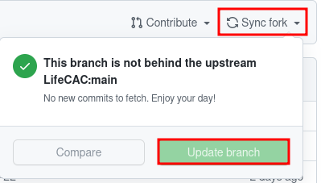

# Git for ProPresenter

This project aims to simplify and guide the process of using git and github with Pro Presenter 7.

#### This guide intensly uses the command line (Bash shell to be exact), If you don't feel comftorable using a terminal, checkout [my command line guide](command-line-basics.md)

If you want a quick cheat sheet with all the important commands, then checkout the ones by [github](https://education.github.com/git-cheat-sheet-education.pdf) and [ATLASSIAN](https://www.atlassian.com/git/tutorials/atlassian-git-cheatsheet), they each have some differences so make sure to go over both to find exactly what you want. Alternatively use the [manual pages](https://linux.die.net/man/) to better understand the arguments that you can parse into a command and when you should do it (Note: the man pages include documentation for many terminal tools other than git so you can use them for those tools aswell)

# Setting up git

#### If you don't have git on your machine, install it:
-[Windows](https://gitforwindows.org/)

-MacOS through [Homebrew](https://brew.sh/)	
```
$ brew install git
```

## Configuring git

#### On Windows run all of these commands in a 'git bash' terminal where as on MacOS you can run them in a normal terminal instance

Add your email and name

```
git config --global user.name "Your name"
```
```
git config --global user.email "youremail@example.com"
```

#### (Optional) Use the main naming scheme


As the world is moving away from the master naming scheme, it might be more conveniet for you to switch away aswell to avoid any confusion.

To switch to main naming scheme run:
```
git config --global init.defaultBranch main
```

## Connecting git to github

#### If you don't already have one, create a [github](https://github.com) account.

Using the terminal run the following command to check if you have an ssh key
```
ls ~/.ssh/id_ed25519.pub
```

If you get a message saying that no such file exists, that means you don't have an ssh-key, that is perfectly fine and expected as you are going to create one in the next step and connect it to your github account.

Create an ssh-key (If you have an ssh key in skip this step)
```
ssh-keygen -t ed25519 -C <youremail>
```

##### Note the'<>' is supposed to be removed and replaced with your email.

When it prompts you for a location to save the generated key, just push Enter.

Next, it will ask you for a password; enter one if you wish, but it's not required.

Next Run
```
cat ~/.ssh/id_ed25519.pub
```
and copy the output

## Link your ssh-key to your github

On Github, click on your profile picture then Settings > SSH and GPG keys then click 'New SSH key' Then paste the output you previously copied into the Key section and add a title (preferably something that lets you know what this key will be used for and/or which computer) Then click 'Add SSH key'

# Using Git

Before we implement git's workflow into our usual Pro Presenter workflow, we first have to learn how to use git, this is what this section aims to achieve.

For now, we will use the current repository you are reading this on as a "learning" repository to give you a better idea of how to use git, later on you will learn how to apply the skills you learned in your Pro Presenter workflow.



## Fork this repository

Fork this repository by clicking on the fork button on the top of this page.
This will create a copy of this repository in your account.

## Clone the forked repository


Now clone the forked repository to your machine. Go to your GitHub account, open the forked repository, click on the code button and then click 'SSH' the _copy to clipboard_ icon.

Open a terminal and run the following git command:

```
git clone "url you just copied"
```

where "url you just copied" (without the quotation marks) is the to this repository (your fork of this project). See the previous steps to obtain the url.



For example:

```
git clone git@github.com:your-name/git-for-propresenter.git
```

where 'your-name' is your GitHub username. Here you're copying the contents of the git-for-propresenter repository from github into your computer.

## Creating a branch

Creating multiple branches lets us mess around within these branches without actually making changes inside of our main local branch, if we like the changes made we can later on merge them into our main branch or push the branch into a remote repository (Github repository in this case).

To create a branch change to the repository directory on your computer (if you are not already there):

```
cd git-for-propresenter
```

Now create a branch and automatically switch to that branch using the `git switch` comand:

```
git switch -c your-new-branch name
```

For example:

```
git switch -c test-branch
```

The `-c` option is used to create a new branch in this case, if you simply want to switch to a branch then simply omit `-c`.

```
git switch your-branch-name
```

## Make necessary changes and commit those changes

Now open `favourite-foods.md` file in a text editor (`nano` in this case), add your name and favourite food to it. Don't add it at the beginning of the file. 

To open the file type:
```
nano favourite-foods.md
```


If you go to the project directory and execute the command `git status`, you'll see there are changes.

Add those changes to the branch you just created using the `git add` command:

```
git add favourite-foods.md
```

Now commit those changes using the `git commit` command:

```
git commit -m "Add your favourite-food to the favourite-foods.md list"
```
replacing 'favourite-food' with your favourite food.

#### In a proffesional enviornment, it is necessary to have good commit messages as it is the only thing a person will be looking for when looking at the commit history. Checkout this well written [CBEAMS](https://cbea.ms/git-commit/) article for more information on how to write a good git commit message.

## Push changes to GitHub

Push your changes using the command `git push`:

```
git push origin -u your-branch-name
```

replacing `your-branch-name` with the name of the branch you created earlier.

## Sumbit your changes to be merged in.

If you go to your repository on GitHub, you'll see a `Copmare & pull request` button. Click on that button.


Now leave a message about what you changed and pull request.



I will try to merge your changes as soon as possible so you can see your changes being displayed in this repository, You will get a notification email once the changes have been merged.

# Using git and github alongside Pro Presenter

#### Note: This section of the guide is not currently well documented for MacOS.

## Setting up

To begin using git and github with Pro Presenter you first need to setup your own fork and branches.


## Fork the main repo

To begin you need to navigate to the main github repo that you will be working off of and make your own fork.


## Clone the fork


#### For the following steps make sure to that ProPresenter is closed or else you might have issues.

Now clone the forked repository to your machine. Go to your GitHub account, open the forked repository, click on the code button and then click 'SSH' the copy to clipboard icon.

Open the terminal and run:
```
git clone < url you just copied >
```

#### Make sure to replace the "< url you just copied >" with the url you copied earlier.

Now open up the repository you just cloned into your Pro Prosenter configuration and library files.

On windows this is located at `C:/Users/user-name/Documents/ProPresenter`

#### Note: if you are using windows file explorer to copy the files over then you need to click on `view` Then make sure to tick the box that says `Show hidden items` before you copy the files, this is because you won't be copying the hidden .git folder if you don't have the option on.

If you want to use a terminal to achieve this task then run:
```
cp path/to/repo/you/just/cloned/* c:/Users/user-name/Documents/ProPresenter
```

#### Make sure to keep the `/*` at the very end of the first path and that user-name is replaced with your username

## Create a branch

Navigate to the git repo that we setup in your ProPresenter files:
```
cd c:/Users/user-name/Documents/ProPresenter
```

Then create a branch using:
```
git switch -c branch-name
```

Make sure that the `branch-name` is replaced with a name that will be descriptive of what you are using it for, example 'sunda-presentation-prep'

The `-c` option is used to create a new branch in this case, if you simply want to switch to a branch then simply omit `-c`.

```
git switch your-branch-name
```

## Syncing your local repo with a remote repo

To make sure you don't run into merge issues when making a pull request, make sure that your local repo is synced with the main remote repo.


### Sync your fork

Go to your fork of the ProPresenter files and click `sync fork` and then if Github detects changes you should be able to `update branch`, if the `update branch` button is grayed out then that means your fork is up to do. 



Next you will need to pull all the changes into your local fork, first change into the directory of your local propresenter files:
```
cd path/to/propresenter/files
```

then run:
```
git pull --rebase
```

#### Later on I will explain how to pull for branches other than the main local branch.

If you get errors stating that your local repo is has uncommited changes, thats fine, run `git status` and try and check if any of the files changed are important, if you don't spot or remember making any important changes it is most likley because of ProPresenter always changing one line in some configuration files, these changes are not that important and can be discarded. There are two ways we can resolve these conflicts.

### Method 1: reseting to the last commit.

By resetting to the last commit you are removing any changes after the commit, THESE CHANGES CAN NOT BE RESTORED SO MAKE SURE TO DO THIS ONLY IF YOU ARE SURE THEY WERE NOT IMPORTANT!!

Run:
```
git reset --hard
```
and you should find yourself back at the last commit, now you should be able to run `git pull` 


### Method 2: Stashing the commits

`git stash` pretty much hides all unstaged changes temporarly until you want to reapply them, simply run:
```
git stash
```

then run `git pull`, to reapply those changes run:
```
git stash pop
```

### Pulling for branches other than the main branch

To pull for a branch you first need to switch to it:
```
git switch branch-name
```

then run:
```
git pull --rebase
```

## Use ProPresenter

Now is the perfect time for you to open up ProPresenter and make any changes/additions you want.

### Important Notes: After the first time of finishing this guide, you won't need to do any of the above steps, simply startover from this point on.

## Staging and commiting changes

To stage all the changes, navigate to c:/Users/user-name/Documents/ProPresenter and open a terminal there or in a terminal window run the following command:
```
cd c:/Users/user-name/Documents/ProPresenter
```
Where user-name is replace with your current username.

Now run:
```
git add .
```
To stage all the changes, at this point you can run `git status` to check all the staged changes but because of how ProPresenter works, most of the changes are going to be giberish file names.

To commit your changes run:
```
git commit -m "Your commit message"
```
Again if you are unsure of how to write a good commit message, checkout [CBEAMS'](https://cbea.ms/git-commit/) on commit messages.

## Pushing changes to GitHub

To push your changes onto github type:
```
git push origin -u your-branch-name
```
If you are unsure what branch you are working off of, type `git branch` and the name of the branch you are working off of should be marked.

## Submit changes to be merged through a pull request

If you go to your repository on GitHub, you'll see a `Copmare & pull request` button. Click on that button.


Now leave a message about what you changed and pull request.


Now you need to wait for your branch to be merged by anyone who was the ability to do so.

# Reverting changes

#### Using the wrong command in here might cause you to erase some progress PROCCED WITH CAUTION!!

Git being a version control system not only lets multiple people collaborate together perfectly without having issues, but it also allows us to roll back any changes incase we make mistakes.

## git log

`git log` is a utility to check all the changes commited to a repo, when running `git log` on any branch, it will show the changes that have been commited and merged to that branch, the output for `git log` should look similar to this:
```
commit 123456789123456789123456789a (branch name where this commit was made on)
Author: author name and email
Date: date and time

	commit message
```

the `123456789123456789123456789a` in this example is what we call a commit hash, the commit hash is important as it is the way we refer to a commit when rolling back changes.

## Using git checkout

As the name states, git checkout is used to checkout changes made in the past. To use it simply type:
```
git checkout < commit-hash >
```
Make sure to remove the "< commit-hash >" and replace it with the commit hash that want to go back to.

Now if you check any file that was changed after that commit, you would relise the files have been changed back to what it was on that exact commit, if you want to go back to the staging area, simply type:
```
git checkout main
```
And you should see yourself back in the current main branch.
